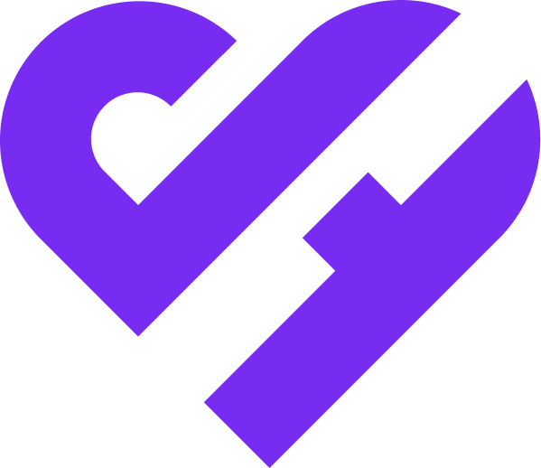
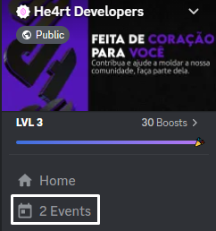


# 
<b> 📝 Documentação He4rt Developers</b> 

## Tabela de Conteúdos

* [O que é essa documentação?](#o-que-e-essa-documentacao)
* [Como eu posso contribuir?](#como-eu-posso-contribuir)
* [He4rt Developers](#he4rt-developers)
* [Nosso time](#nosso-time)
  *  [Líderes (He4rtless)](#lideres)
  * [Equipe de Administração](#equipe-de-administracao)
 * [Projetos](#projetos)
   * [He4rt Meetup](#he4rt-meetup)
   * [He4rt Conf](#he4rt-conf)
   * [He4rt Delas](#he4rt-delas)
   * [4Noobs](#4noobs)
   * [He4rtLive](#he4rt-live)
   * [He4rtBot](#he4rt-bot)
   * [Aulões](#auloes)
   * [Aulas de Inglês](#aulas-de-ingles)
   * [Grupos de conversação (em Inglês)](#grupos-de-conversacao)
   * [Reuniões semanais](#reunioes-semanais)
   * [Reunião das minas](#reuniao-das-minas)
  * [Cargos](#cargos)
  * [Punições e moderação](#punicoes-e-moderacao)

## O que é essa documentação?

— Muitos membros da comunidade, novos e antigos, não conheciam a comunidade como um todo e então notamos a falta de uma documentação que detalhasse tudo que consideramos necessário de terem conhecimento. Essa documentação tem o intuito de explicar com maiores detalhes o ecossistema da **He4rt Developers**.
 
 

## Como eu posso contribuir?

— Para contribuir para essa documentação, seja com correções ortográficas ou adicionando um novo conteúdo, basta acessar o repositório oficial, fazer um fork dele, criar uma branch com o seu nome/apelido, fazer a sua contribuição, enviar um pull request e então um dos revisores irá avaliar suas alterações.
 
 

## He4rt Developers

— A comunidade **[He4rt Developers](https://heartdevs.com/)** é um grupo fomentado por **pessoas desenvolvedoras de software**, **estudantes de tecnologia**, **entusiastas por comunidades** e/ou **software livre** e muitos outros reunidos no servidor no Discord e ativos em outras redes sociais. Nossa filosofia impõe educação de qualidade em tecnologia para todas as pessoas de forma acessível e gratuita.

Acreditamos também na importância da participação de todos os nossos membros nas tomadas de decisão durante os nossos encontros semanais. Também influenciamos as pessoas a contribuírem para a comunidade pois tudo aquilo que ela promove irá retornar para ela de alguma forma, sem fins lucrativos.

Tudo que construímos juntos é em prol ***da comunidade para a comunidade.*** Inclusive essa documentação que você está lendo agora, feita por membros que se dispuseram para contribuir.

Para entender melhor sobre a **estruturação do nosso servidor no Discord, [acesse aqui](./subpage/discord-community.md)**.
 

  
  
  
  
  

 
 

## **Nosso time**

> “*Com grandes poderes vêm grandes responsabilidades.” - Tio Ben, Stan Lee.*

— Para que pudéssemos chegar aonde estamos, foi necessário uma boa equipe administrativa para que mantivesse tudo nos conformes, inovando, moderando e mantendo nossos ideais vivos. Então, conheça nosso incrível time:

### *Líderes  (He4rtless)*

- **Daniel Reis -** *Fundador*

    Discord: @danielhe4rt#0001, [Twitter](https://twitter.com/danielhe4rt), [LinkedIn](https://www.linkedin.com/in/danielheart/)

- **Gustavo Lima** - *Co-fundador*

    Discord: @Gustavo 🔥#6479, [Twitter](https://twitter.com/kjkGustavo), [LinkedIn](https://www.linkedin.com/in/kjkGustavo/)

- **Felipe Gabriel** - *Diretor de Operações*

    Discord: @7K#5595, [Twitter](https://twitter.com/setekpro)

- **Júlia Vaz** - *Social Media*

    Discord: @jujuvaz#8755

- **Pride** -  *Joker - Dono do Discord*

    Discord: @'Pride#5559

### *Equipe de Administração*

- **Gabriel Mazieri** - *Community Manager*

    Discord: @GrandeHe4rt#3106, [Twitter](https://twitter.com/grandehe4rt), [LinkedIn](https://www.linkedin.com/in/grandehe4rt/)

- **Gabriel Vieira** - *UI/UX Designer*

    Discord: @'NexTurHe4rt#7503, [Twitter](https://twitter.com/NexturHe4rt), [LinkedIn](https://www.linkedin.com/in/gabrielnx/)

- **Giovane Silva** - *Contribuidor principal*

    Discord: @Novout#0001

- **Luis Eduardo** - *Líder de Moderação*

    Discord: @Nadachi#2043, [Twitter](https://twitter.com/Luis_Nadachi), [LinkedIn](https://www.linkedin.com/in/luis-eduardo-teixeira/)

- **Mateus Pinheiro** - *Contribuidor Principal*

    Discord: @m7ez1n🤬#6235, [Twitter](https://twitter.com/m7ez1n), [LinkedIn](https://www.linkedin.com/in/m7aei/)

- **Yasmin Felício** - *Community Manager*

    Discord: @yaya#5286, [Twitter](https://twitter.com/yayaflc), [LinkedIn](https://www.linkedin.com/in/yasminccfe/)

 
 

## **Projetos**

## *He4rt Meetup*

— A **He4rt Meetup** são eventos **híbridos** que ocorrem na intenção dos membros se encontrarem *in real life*. Durante esses eventos geralmente ocorrem **palestras, entrevista com convidados especiais, coffee break** e muito **networking.** Apesar dos encontros serem focados para o presencial, nossos Meetups também possuem **transmissões online** pela **[Twitch](https://www.twitch.tv/danielhe4rt).** Dessa maneira, todos os nossos membros podem aproveitar nossos eventos, mesmo de longe.

## *He4rt Conf*

— A **[He4rt Conf](https://conf.heartdevs.com/)** é uma iniciativa que visa **democratizar** e **facilitar** o **acesso a conteúdos de alta qualidade** produzidos pela comunidade, sendo **100% gratuito**, contendo palestras de convidados especiais, além de brindes patrocinado pelas empresas parceiras para todos os participantes. A primeira edição (e até então a única) ocorreu nos dias 01, 02 e 03 de Outubro de 2021.

## *He4rt Delas*

— A **He4rt Delas** é um projeto de **iniciativa feminina** com a intenção de incentivar, integrar e apoiar **mulheres cis, trans** e **pessoas não-binárias** a ingressarem na área de tecnologia e na nossa comunidade, promovendo um espaço seguro e acolhedor para as mesmas.

O projeto é composto por um **comitê** para as tomadas de decisões e administração dos projetos internos da He4rt Delas. As participantes do comitê são: *Alice, Amanda, Carolina, Colares, Gabi, Lai, Lorena e Yaya.*

## *4Noobs*

— O projeto **4Noobs** nasceu com o objetivo de ser um espaço onde as pessoas pudessem encontrar conteúdo de **fácil entendimento** em um primeiro encontro com determinado tema, promovendo uma melhor capacitação profissional. A intenção desse **Open Source** é que as pessoas de diferentes níveis de entendimento pudessem contribuir, pois acreditamos que **você não precisa ser um expert para poder ensinar sobre algo.**

Para saber mais sobre o 4Noobs, **[acesse aqui](https://github.com/he4rt/4noobs)**.

## *He4rtLive*

— A **He4rtLive** tem como objetivo apoiar e incentivar o crescimento da comunidade de criadores de conteúdo na Twitch de todas as categorias, principalmente ***LiveCoding**.* O projeto consiste em recrutar Streamers parceiros, disponibilizando total apoio através da He4rt Developers. Oferecemos serviços como: *criação de design, divulgação, equipe de moderação* e *entre outros*.

Para acessar o nosso time de Streamers parceiros, [**clique aqui**](https://www.twitch.tv/team/he4rt).

## *He4rtBot*

— O **[He4rtBot](https://github.com/he4rt/he4rt-bot-next)** surgiu após identificarmos a necessidade de **melhorar a performance dos nossos serviços** dentro do nosso servidor do Discord. Sendo um projeto **Open Source** feito do zero pela nossa própria comunidade, o He4rtBot além de conter diversos [comandos](./subpage/discord-community.md) para aprimoramento e coleta de métricas, também possui um **Sistema de Temporadas**, onde nossos membros podem subir de nível e coletar emblemas de conquista por participar de eventos, como se fosse um joguinho.

## *Aulões*

— O projeto dos **Aulões** permite que os membros de dentro e fora da comunidade possam **compartilhar conteúdo através de palestras** em uma data previamente agendada. Fazemos a abertura e fechamento da agenda mensalmente para que os membros se organizem com antecedência para comparecer.

Você pode consultar nosso calendário de eventos no nosso servidor pela lateral esquerda superior.

    

## *Aulas de Inglês*

— Na nossa comunidade temos aulas de inglês com o professor **João Corrêa** também conhecido por **Teacher João** para quem não entende nada de inglês, para aqueles com insegurança no idioma e também para aqueles que não entendem muitos termos técnicos da área de tecnologia e software. O nosso professor de inglês além de muito experiente, é familiarizado e tem repertório com a tecnologia que usamos todos os dias e muitas vezes não compreendemos por completo.

As aulas de inglês no momento entraram em recesso e estão previstas para retornarem em **fevereiro de 2023.**

## *Grupos de conversação (em Inglês)*

— Os grupos de conversação surgiram com a necessidade dos membros de terem um local para praticar seus conhecimentos em Inglês com outras pessoas de forma descontraída. Dentro da nossa comunidade no Discord temos o canal de voz **#🇬🇧 Only English**, que é o local no qual os membros de diversos níveis de Inglês, do iniciante ao fluente, se reúnem para conversar e trocar conhecimentos.

## *Reuniões semanais*

— As reuniões semanais acontecem toda **segunda-feira**, **às 22h**, com o intuito de **reunir a comunidade para conversar**, **discutir** e **fofocar** sobre os assuntos da semana. Utilizamos esse espaço para repassar avisos importantes e o calendário semanal da comunidade, além de incentivarmos a presença mais ativa dos nossos membros.

## *Reunião das minas*

— A reunião das minas acontecem toda **terça-feira**, **às 20h**, onde as pessoas que se identificam com o projeto **He4rt Delas** e o restante da comunidade são convidados para **apoiar a presença de mulheres cis**, **trans** e **pessoas não-binárias** à fazerem parte da He4rt Developers. Na reunião *quem manda são as minas*, desde a organização, até as tomadas de decisões do projeto.
 
 

## **Cargos**

— Dentro do nosso servidor no Discord, nossa comunidade é organizada através de **cargos**, para que assim possamos separar e identificar funções, títulos e honorárias.

**He4rtless** ⇒ São os principais líderes da comunidade, membros que fizeram parte da fundação da comunidade e que persistem presentes até hoje na liderança e nas tomadas de decisão. São membros que estão no topo do organograma da comunidade e possuem um maior repertório de como funciona a nossa comunidade e são os melhores na hora de decidir os próximos passos da He4rt.

**He4rt** ⇒ São os membros mais ativos que se **sobressaem entre os demais** pela sua relevância, participação e contribuição. Esses membros são especiais por serem aqueles que vestem a camisa da comunidade e compactuam muito com o que ela representa e proporciona. É um cargo de **honraria**.

💼 **Equipe de Administração** ⇒ Membros que possuem responsabilidades administrativas dentro e fora da comunidade.

👮‍♂️ **Equipe de Moderação** ⇒ São os membros responsáveis de moderar nossa comunidade dentro do Discord. Eles cuidam para que a harmonia e educação reine nos nossos chats de texto/voz

💳 **Apoiadores** ⇒ Esse cargo é atribuído aos apoiadores financeiros da comunidade através da plataforma [apoia.se/heartdevs](http://apoia.se/heartdevs). Para ser um apoiador, basta fazer uma doação de do mínimo R$5 e utilizar o comando **/apoiase (seu email)** em qualquer chat do nosso Discord.

⚡ **Nitro Booster** ⇒ Cargo designado à aqueles que “boostam” o servidor da comunidade através do Discord Nitro, concedendo ao nosso servidor privilégios como: **mais slots de emotes e stickers, melhor qualidade de áudio e transmissões de videos**. Esses membros além de receberem o cargo **Nitro Booster**, eles conseguem customizar um perfil exclusivo dentro do servidor e recebem uma insígnia brilhante única.

🎓 **Mentores** ⇒ São aqueles que se voluntariaram a serem mentores dentro da comunidade, ajudando aqueles que ainda estão um pouco perdidos nos estudos.

🤝 **Parceiros** ⇒ Membros e empresas que ajudam efetivamente a comunidade em diversos setores.
 
 

## **Punições e moderação**

A He4rt Developers **preza pelo bem estar** e por **um lugar seguro para todos**. Por isso, somos extremamente rígidos e **não toleramos qualquer tipo de discriminação ou preconceito**, seja por etnia, gênero ou sexualidade. Para consultar nosso código de conduta, [clique aqui.](./subpage/code-of-conduct.md)

**Alerta:** Dependendo da situação, antes de tomarmos qualquer ação de punimento, nós avisamos a pessoa sobre seu erro e esperamos por justificativa, se a pessoa reconhece o erro e pede sinceras desculpas, ela receberá apenas um alerta.

**Banimentos:** Ao receber um banimento dentro da He4rt, ele é por tempo indeterminado, no entanto ainda estamos abertos a reclassificar o seu caso dependendo da situação. Se o motivo pelo banimento envolve alguma pessoa da comunidade, iremos contata-la e você só receberá sua segunda chance se ela concordar com essa decisão.

Caso presencie alguma situação que infrinja nossas regras ou que se sinta ofendido ou desconfortável com alguma situação, utilize nossa **sistema de denúncias anônimas**, abrindo um ticket pelo canal **#🚨denúncias-reclamações**, que um membro da equipe de administração entrará em contato para tomar as medidas necessárias.

---

<i> Da comunidade para a comunidade. 💜</i>

